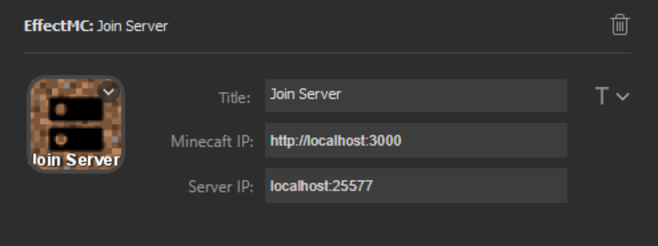

# Join Server Effect

## Description
Connect to a specified Minecraft server when triggered. The server ip does not appear on screen, and the server is not added to the server list.

Automatically saves the world in singleplayer and disconnects from a server in multiplayer, if required. Can be triggered from any screen, including the main menu.

## Configuration Options

- Title (optional): An optional title to display on the key. Customize location and font using the T icon to the right of the text box.
- Minecraft IP (required): The address that the EffectMC mod is running on. (Example: `http://localhost:3000`)
- Server IP (required): The IP of the server to connect to. Similar to the Direct Connect option in the Multiplayer menu.

## Example Configuration

## In-Game Experience

### In-World

### From Main Menu

