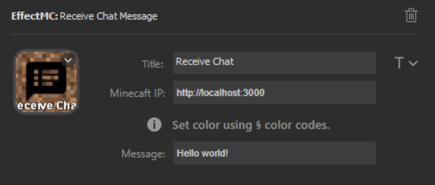

# Receive Chat Message Effect

## Description
Display a message in the chat screen, as if a player sent a message. This message is displayed in a similar fasion to the /tellraw command in that no player is visibly attached to the message.

## Configuration Options

- Title (optional): An optional title to display on the key. Customize location and font using the T icon to the right of the text box.
- Minecraft IP (required): The address that the EffectMC mod is running on. (Example: `http://localhost:3000`)
- Message: The message to show in chat. 

## Example Configuration

## In-Game Experience

Two seperate send chat message effects are triggered in this gif to give examples of receive a normal chat message and a message with custom formatting.

![Gif of the player staring at a tree. An in-game message pops up, saying "Hello world!". A second colorful message pops up, saying "Colors work! Others work as well: [giberish]"](img/receive-chat-message-example.gif)