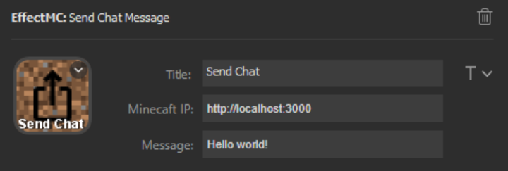

# Send Chat Message Effect

## Description
Sends a message in chat as if you had typed it. This also works with commands, just prefix with a `/` character as normally done in the chat screen.

## Configuration Options

- Title (optional): An optional title to display on the key. Customize location and font using the T icon to the right of the text box.
- Minecraft IP (required): The address that the EffectMC mod is running on. (Example: `http://localhost:3000`)
- Message: The message to send in chat. Commands are prefixed by the `/` character.

## Example Configuration

## In-Game Experience

Two seperate send chat message effects are triggered in this gif to give examples of sending a chat message and executing a command.

