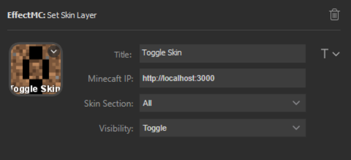

# Set Skin Layer Effect

## Description
Toggle the visibility of some or all parts of your Minecraft skin.

There is also the option to set the visibility instead of toggleing it.

## Configuration Options

- Title (optional): An optional title to display on the key. Customize location and font using the T icon to the right of the text box.
- Minecraft IP (required): The address that the EffectMC mod is running on. (Example: `http://localhost:3000`)
- Skin Section (required): The section of skin to toggle/set the visibility of. Here are the options:
    - All: All sections will be set/toggled
    - All Body: All sections except the cape will be set/toggled
    - Cape
    - Left Sleeve
    - Right Sleeve
    - Left Pant Leg
    - Right Pant Leg
    - Hat
- Visibility (required): Set whether to toggle, show, or hide the selected skin section. Note that toggling with All or All Body will toggle each section individually.

## Example Configuration

## In-Game Experience

Two seperate Set Skin Layer effects are triggered in this gif to give examples of toggling all layers and hiding just the hat. After hiding the hat, the all layer toggle is triggered a few more times to demonstrate how the toggle all/all body toggles each section individually.

