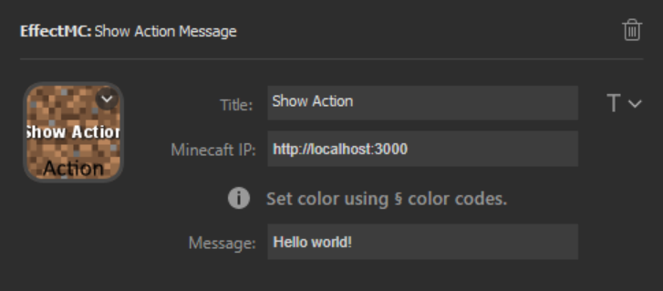

# Show Action Message Effect

## Description
Display a message on the action bar. Formatting codes using the `§` character are supported.

## Configuration Options

- Title (optional): An optional title to display on the key. Customize location and font using the T icon to the right of the text box.
- Minecraft IP (required): The address that the EffectMC mod is running on. (Example: `http://localhost:3000`)
- Message: The text to display in the action bar slot. Formatting codes using the `§` character can be used here.

## Example Configuration

## In-Game Experience

Two seperate show action message effects are triggered in this gif to give examples of a regular message and a message using formatting codes.

![Gif of the player staring at the ground. Two messages appear on screen above their hotbor. The first says "Hello World!", the second is a multi-colored message saying "Colors work too! Others work as well: [giberish text]"](img/show-action-message-example.gif)
