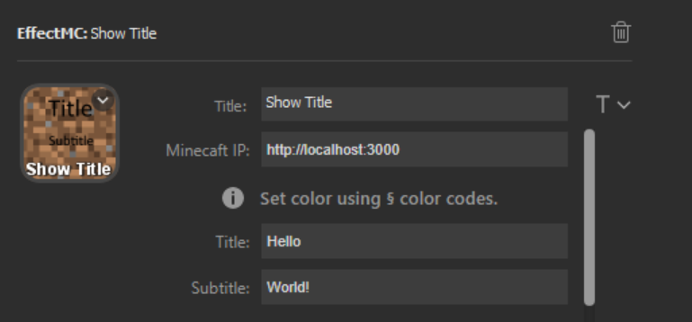

# Show Title Effect

## Description
Display a title and/or subtitle on screen as if using the /title command. The ability to run the /title command is not required. Formatting codes using the `§` character are supported.

To ignore either the title or subtitle, place a space in the corresponding text box when configuring the action.

## Configuration Options

- Title (optional): An optional title to display on the key. Customize location and font using the T icon to the right of the text box.
- Minecraft IP (required): The address that the EffectMC mod is running on. (Example: `http://localhost:3000`)
- Title (required): The title to display. To not show a title, place a space in this text box.
- Subtitle (required): The subtitle to display. To not show a subtitle, place a space in this text box.

## Example Configuration

## In-Game Experience

Three seperate title effects are triggered in this gif to give examples of a title/subtitle combo effect, a subtitle only effect, and a title/subtitle using formatting codes.

![Gif of the player staring at the sky. Three title/subtitle pairs appear on screen. The first says "Hello" with a subtitle of "World!", the second is a subtitle that says "This is only a subtitle!", and the third is multi-colored title and subtitle saying "Colors work too! Others work as well: [giberish text]"](img/show-title-example.gif)
